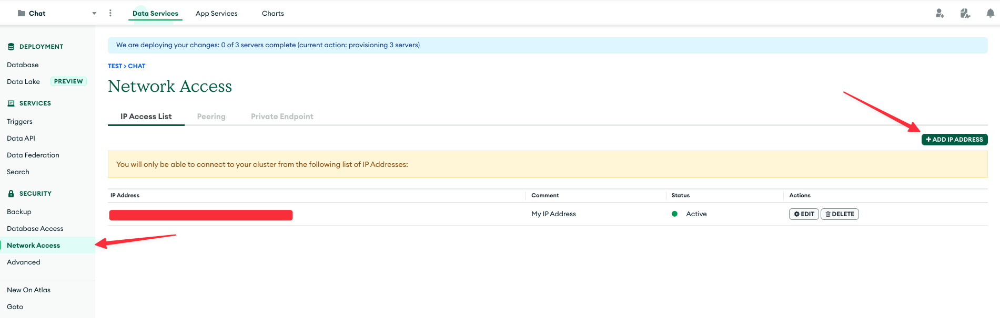
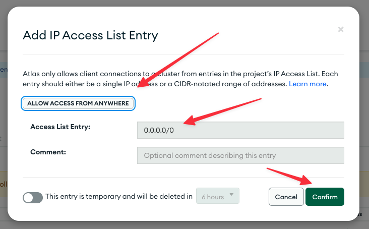

# My Learning

## Steps to prepare the environment

### 1 - Install pyenv

```bash
brew update
brew install pyenv
brew install pyenv-virtualenv
```

Set up your shell environment for Pyenv:

For Zsh:

```bash
# pyenv
echo 'export PYENV_ROOT="$HOME/.pyenv"' >> ~/.zshrc
echo 'command -v pyenv >/dev/null || export PATH="$PYENV_ROOT/bin:$PATH"' >> ~/.zshrc
echo 'eval "$(pyenv init -)"' >> ~/.zshrc

# pyenv-virtualenv
echo 'eval "$(pyenv virtualenv-init -)"' >> ~/.zshrc
```

More info:

- https://github.com/pyenv/pyenv
- https://github.com/pyenv/pyenv-virtualenv

Install the same Python version from [app.py](./app.py)

```bash
pyenv install 3.10.9
```

### 2 - Activate the environment

```bash
pyenv shell 3.10.9
```

Create a new virtual environment

```bash
pyenv virtualenv 3.10.9 ask-fsdl
```

Activate the new virtual environment

```bash
pyenv activate ask-fsdl
```

### 3 - Prepare the environment

Setup the environment

```bash
make dev-environment
make environment
```

### 4 - Get the environment variables

Create Modal account: https://modal.com/

Set up the Modal local environment

```bash
pip install modal-client
modal token new
```

You going to find the Modal API Key at `/Users/<your-user>/.modal.toml`;

---

Create Open API account: https://openai.com/ and get the Open API Key.

---

Create a Mongo DB Atlas account: https://www.mongodb.com/cloud/atlas/register;

Create a Data base cluster and get the Mongo DB URI Endpoint, Mongo DB user and Mongo DB password to access your database cluster.


Create the database (`fsdl`) and collection (`ask-fsdl`).


Enable the network access





---

Create a new file based on the `.env.example` and copy all API Keys and Mongo DB there.

### 5 - Extract and store data

Access the [Running ETL to Build the Document Corpus.ipynb](./Running%20ETL%20to%20Build%20the%20Document%20Corpus.ipynb) and run all steps
