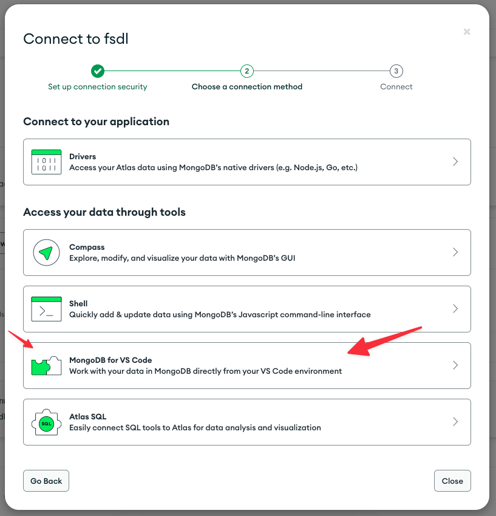

# My Learning

## Steps

### 1 - Prepare environment

First install pre-commit

```bash
pip install pre-commit
```

Setup the environment

```bash
make dev-environment
```

### 2 - Get the environment variables

Create Modal account: https://modal.com/

Set up the Modal local environment

```bash
pip install modal-client
modal token new
```

You going to find the Modal API Key at `/Users/<your-user>/.modal.toml`;

---

Create Open API account: https://openai.com/ and get the Open API Key.

---

Create a Mongo DB Atlas account: https://www.mongodb.com/cloud/atlas/register;

Create a Data base cluster and get the Mongo DB URI Endpoint, Mongo DB user and Mongo DB password to access your database cluster.





---

Create a new file based on the `.env.example` and copy all API Keys and Mongo DB there.

### 3 - Extract and store data

Access the [Running ETL to Build the Document Corpus.ipynb](./Running%20ETL%20to%20Build%20the%20Document%20Corpus.ipynb)
