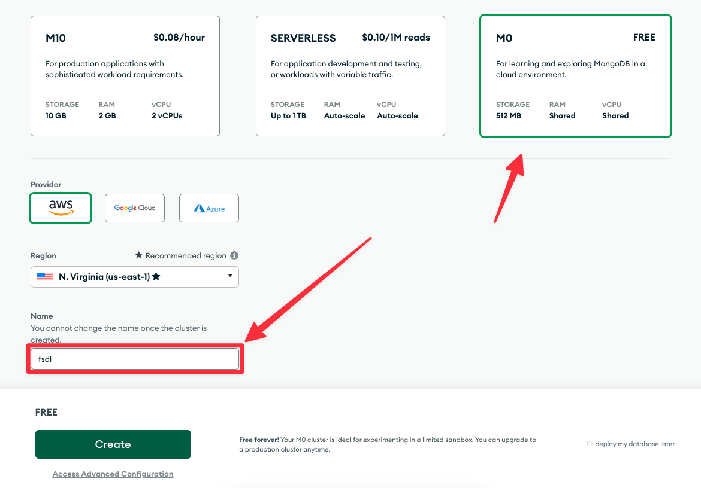
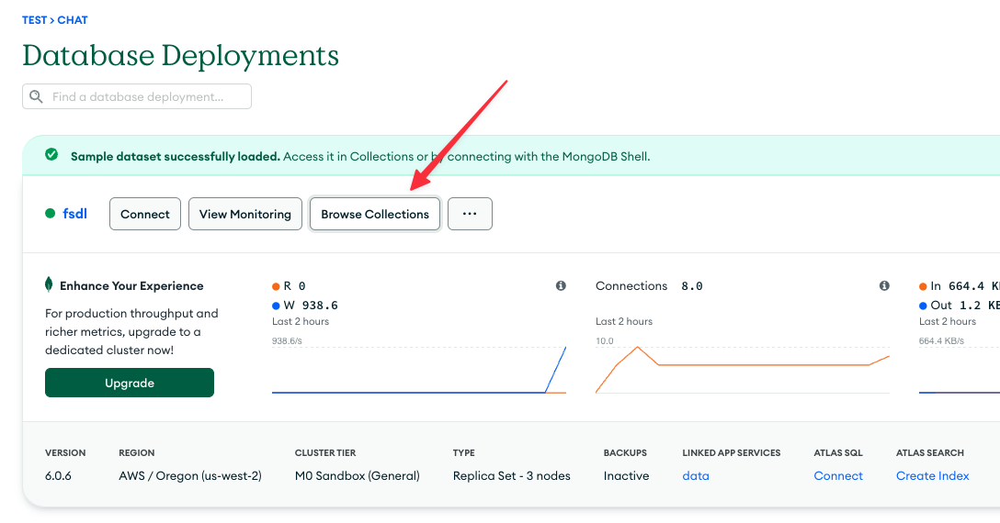
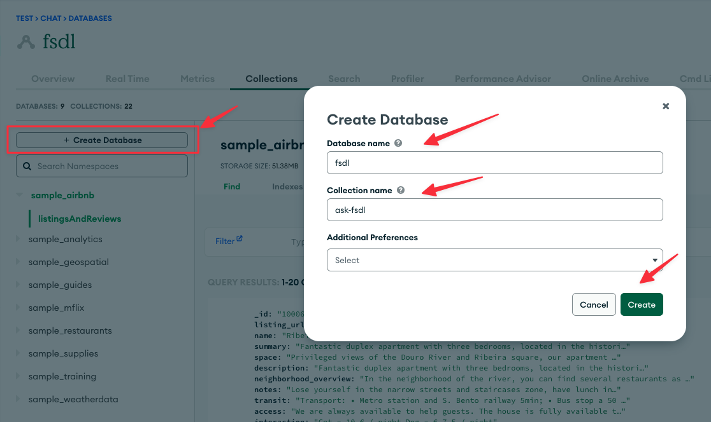
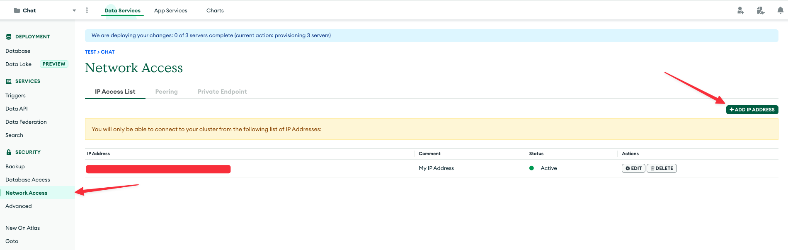
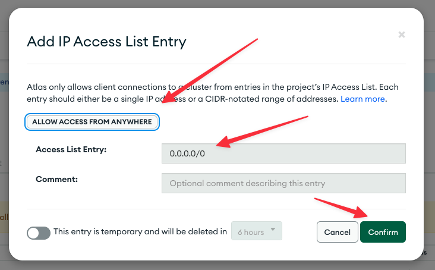
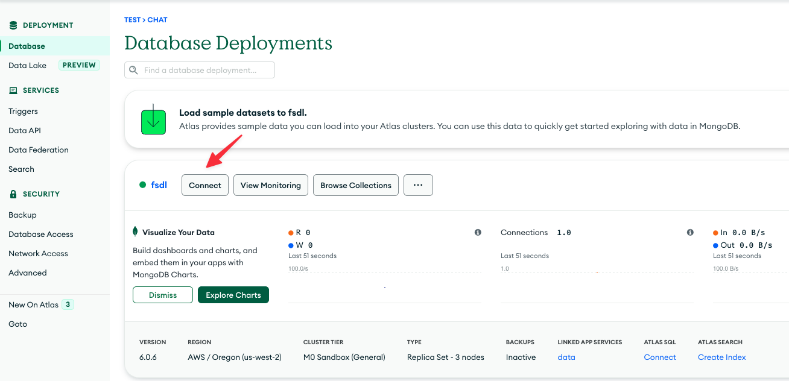
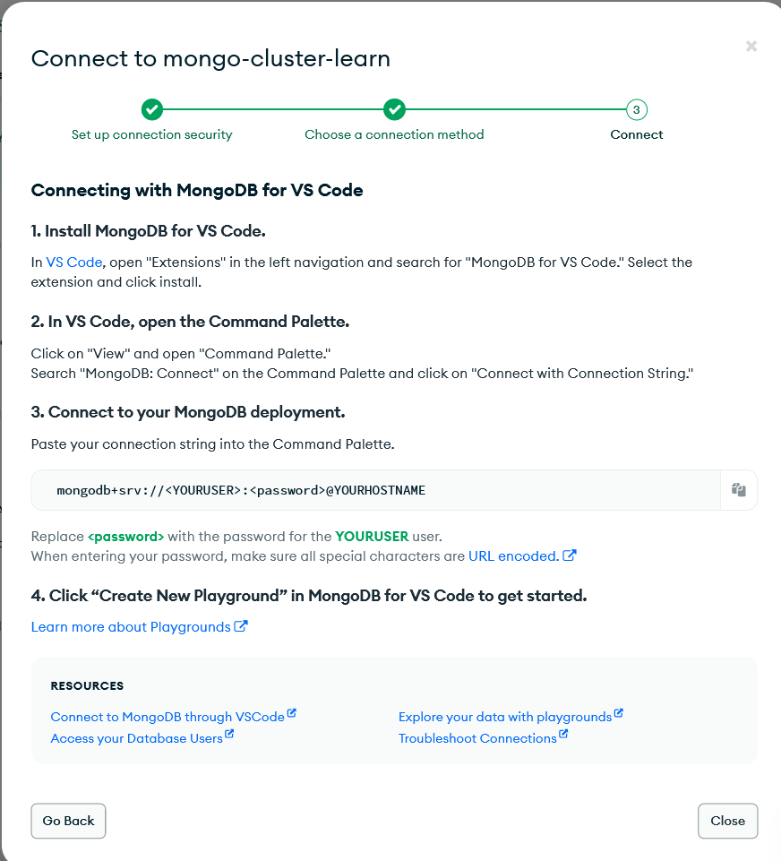
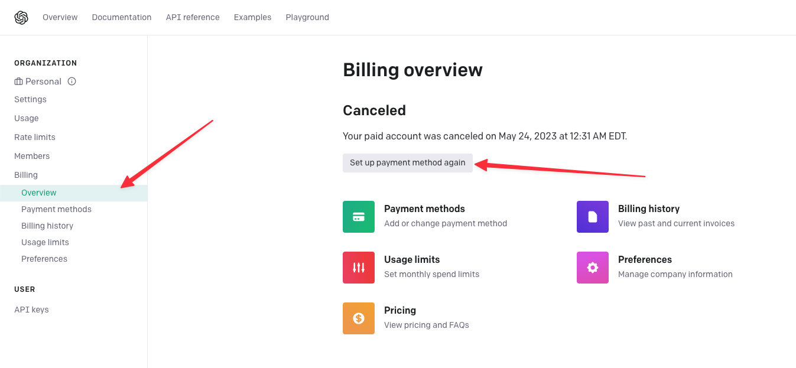

# Setup from scratch

> These instructions are a community contribution
> (thanks [@candidosales](https://github.com/candidosales)!)>
> and are provided on a best-effort basis.
>
> These instructions detail steps in the process for setting up this project from scratch.
> They cover Python environment setup up through deployment of the backend.
> They do not cover Python installation or creation of the Discord bot.
>
> If you notice and resolve an error during setup, we'd be grateful if you submitted a PR to fix it
> and these docs.

## I. Setup the configuration file

The `Makefile` gets configuration information like usernames and secrets from
[dotenv files](https://www.dotenv.org/docs/security/env.html).

We've included an empty template file, `.env.example`. Copy it to `.env` with:

```bash
cp .env.example .env
```

If you want a dev environment you can also copy it to `.env.dev`:
```bash
cp .env.example .env.dev
```

To switch between the production and development environments, set the `ENV` variable to `prod` or `dev`, respectively.

```bash
export ENV=dev  # set it as an environment variable
ENV=prod make help # or set it for each make command
```

## II. Prepare the Python environment

There are [many ways](https://xkcd.com/1987/)
to manage Python environments.
We use `pyenv` + `pyenv-virtualenv`,
but you're welcome to use another method.

The only restriction is that the `Makefile` presumes that `python -m pip install` works for installing into the intended environment.
If you violate this assumption, you will not be able to use any of the `make` commands.

If you're not using `pyenv` + `pyenv-virtualenv`,
skip to step 4.

### 1 - Install `pyenv` + `pyenv-virtualenv`

Follow the installation instructions
[here for `pyenv`](https://github.com/pyenv/pyenv)
and [here for `pyenv-virtualenv`](https://github.com/pyenv/pyenv-virtualenv).
Don't forget to follow the instructions for
setting up your shell environment!

To activate `pyenv` and `pyenv-virtualenv`,
restart your shell after setting up the shell environment.

### 2 - Install Python

`pyenv` installs Python.

We use Python 3.10 and later in our development.
You can install it with:

```bash
pyenv install 3.10.9
```

### 3 - Create and activate the virtual environment

Environments isolate libraries used in one context from those used in another context.

For example, we can use them to isolate the libraries used in this project from those used in other projects.

Done naively, this would result in an explosion of space taken up by duplicated libraries.

Virtual environments allow the sharing of Python libraries across environments if they happen to be using the same version.

We create one for this project with:

```bash
pyenv virtualenv 3.10.9 ask-fsdl
```

To start using it, we need to "activate" it:

```bash
pyenv activate ask-fsdl
```

We've set it as the default environment for this directory with:
```bash
pyenv local ask-fsdl
```
which generates a `.python-version` file in the current directory.

### 4 - Install the dependencies

Now that we have an environment for our project,
we can install the dependencies.

If you're interested in contributing, run

```bash
make dev-environment
```

which adds a few code quality checkers.
Otherwise, run

```bash
make environment
```

## II. Set up managed services and configure the app to use them

From here, the `Makefile` will handle a lot of the heavy lifting
for coordinating all the pieces of the project.

Run `make help` to see all of the things it can do.

```bash
make help
```

However, it needs some information from you
and some resources, like accounts on managed services,
cannot be created automatically.

### 1 - Create a Modal account: https://modal.com/

We'll be running our application on Modal, which provides
serverless infrastructure for data science/ML projects
with a best-in-class developer experience.

Modal includes a free tier that should support hundreds of requests per day for our app.

Follow the instructions for getting an account --
at time of writing, Modal is in private beta but requests are generally approved quickly.

Once you've done that, run

```bash
make modal-token
```

and follow the instructions in the terminal.

Run

```bash
make modal-auth
```

to confirm that you've set up your Modal account correctly.

### 2 - Create an OpenAI account: https://openai.com/

We use language models and embeddings from OpenAI's language-modeling-as-a-service API.

So you'll need to create an OpenAI account.

Sign up [here](https://platform.openai.com/signup?launch) and get an API key.

Make sure you set up a payment method!

> Creating the embeddings is cheap, on the order of a fifty cents.
>
> But _each query of the chatbot_ costs a few cents, so you might also want to set a limit on your account.

Add the OpenAI API key to the dotenv file.

### 3 - Configure a MongoDB document store

We store our source corpus in MongoDB,
which is a [document database](https://www.mongodb.com/document-databases).
The things we store look like JSON objects,
which makes it easy to work with them in Python and Javascript.

The easiest way to use MongoDB is with the managed service from the creators of MongoDB, [MongoDB Atlas](https://www.mongodb.com/cloud/atlas/).
The project fits within the free tier very comfortably.

Alternatively, you can run a MongoDB instance locally or on a server you control,
but we don't include any instructions for this path.
Once you have the database set up, jump to the final step below.

#### a - Create a Mongo DB Atlas account

Follow instructions [here](https://www.mongodb.com/cloud/atlas/lp/try4).

#### b - Create a cluster for your database



#### c - Create a database and document collection

A document collection is like a table in a relational database.

Name them `fsdl` and `ask-fsdl`, respectively.




#### d - Create a user and password

See instructions [here](https://www.youtube.com/watch?v=5-hybmPlZ_U&t=11s).
Add the username and password to the dotenv file.

Make sure you save the password somewhere safe as well,
like a password manager.

#### e - Enable network access





#### f - Get the information required to connect to the database

To allow the application to connect to the database,
we need to construct a
[connection string](https://www.mongodb.com/docs/manual/reference/connection-string/),
a
[URI](https://en.wikipedia.org/wiki/Uniform_Resource_Identifier)
for connecting to databases.

To construct the connection string,
we need three pieces of information:

1. The name of the host where the database is running
2. The name of a database user with read/write access to the database and its collections
3. The password for that user

This information goes in the dotenv file.
You should have already entered the username and password
while creating the user.
If not, you'll need to retrieve the password
from wherever you stored it.

You can find the rest of the information
in the "Connect" tab of the MongoDB Atlas dashboard:






### 5 - Push all of the configuration information to Modal

For the application to run,
it needs the information in the dotenv file.

We push that information to Modal with

```bash
make secrets
```

As a side effect, this will confirm that all of the necessary information is provided.

## III. Extract and store data

The sources used by the chatbot come from many places
and are stored in a variety of formats.

We bring them in and format them all as JSON documents
with a particular structure.

We also make them searchable with a
[vector index](https://www.pinecone.io/learn/wild/).

### 1 - Extract data, transform it, and load it into the document store

```bash
make document-store
```

Optionally, to learn more about the process,
check out the [included Jupyter notebook](./Running%20ETL%20to%20Build%20the%20Document%20Corpus.ipynb).

Run all steps to create the full document store.

### 2 - Create a vector index for embedding-based search

We use a vector index to find the most similar documents to a given query.

You can create it with

```bash
make vector-index
```

At time of writing, the vector index is a
[FAISS index](https://github.com/facebookresearch/faiss)
that is read from disk at query time.

## IV. Run the backend

You're now ready to ask the chatbot a question!

Use this command, and feel free to substitute your own query.

```bash
make cli-query QUERY="What can you do?"
```

You can turn this into a web service with

```bash
make backend
```

## V. Next steps

To run the full Discord bot, you'll need

1. A Discord account
2. A Discord server that your bot can join
3. A Discord bot account

You'll also need to update the `.env` file with this information.
See `.env.example` for the field names.

There's a guide from
[Real Python here](https://realpython.com/how-to-make-a-discord-bot-python/).

We host our bot on AWS EC2,
which additionally requires an AWS account.
See [instructions here](https://aws.amazon.com/ec2/getting-started/).
You'll also need to create an [EC2 key pair](https://docs.aws.amazon.com/AWSEC2/latest/UserGuide/ec2-key-pairs.html)
called `fsdl-webserver-keys`.

The bot fits within the free allotment to new AWS accounts.

We use [Pulumi](https://www.pulumi.com/)
to automate the creation of the infrastructure on AWS --
everything [except that EC2 key pair](https://www.pulumi.com/registry/packages/aws/api-docs/ec2/keypair/).
You'll need a Pulumi account; see
[instructions here](https://www.pulumi.com/docs/get-started/).
You'll also need to
[install Pulumi](https://www.pulumi.com/docs/install/).

Once you have all of that set up,
these make commands will get you up and running:

```bash
make backend
make frontend
```

You can also do the whole setup at once with

```bash
make it-all
```

Note that this wipes the existing database and vector index!

## Troubleshooting

### Retrying langchain.embeddings.openai.embed_with_retry.<locals>.\_embed_with_retry in 4.0 seconds as it raised RateLimitError: Your account is not active, please check your billing details on our website.

Set up payment method: https://platform.openai.com/account/billing/overview


